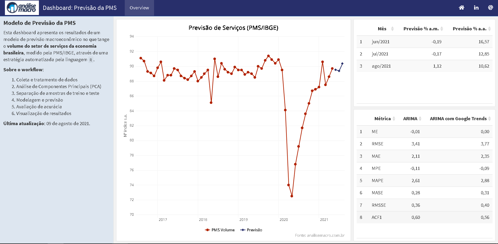

<!-- README.md is generated from README.Rmd. Please edit that file -->

# pms

<!-- badges: start -->

[](https://github.com/analisemacropro/pms/actions)
<!-- badges: end -->

O objetivo deste pacote é gerar um **modelo automatizado de previsão do
volume do setor de serviços** da economia brasileira medido pela
**[PMS/IBGE](https://www.ibge.gov.br/estatisticas/economicas/servicos/9229-pesquisa-mensal-de-servicos.html)**.
Além de realizar a modelagem e previsão, o pacote reporta os resultados
através de uma [dashboard](https://analisemacropro.github.io/pms/)
resumo.

Este pacote desenvolvido em `R`, o modelo, os códigos, etc. fazem parte
dos **cursos da [Análise Macro](https://analisemacro.com.br/)**.

## Licença

Copyright 2021 Análise Macro. All rights reserved.

## Sobre o workflow

Utilizando o pacote `fable`, são estimados dois modelos: ARIMA
univariado e ARIMA com dados do Google Trends.

As etapas realizadas podem ser descritas conforme abaixo:

| Procedimento                                | Função                  |
|---------------------------------------------|-------------------------|
| 1\) Coleta e tratamento de dados            | `pms::data_etl()`       |
| 2\) Análise de Componentes Principais (PCA) | `pms::data_etl()`       |
| 3\) Separação de amostras de treino e teste | `pms::data_split()`     |
| 4\) Modelagem                               | `pms::model_fit()`      |
| 5\) Previsão                                | `pms::model_forecast()` |
| 6\) Avaliação de acurácia                   | `pms::model_accuracy()` |
| 7\) Visualização de resultados              | `pms::run_dashboard()`  |

## Instalação

O pacote pode ser instalado através do [GitHub](https://github.com/) com
o `remotes`:

``` r
if(!require("remotes")) install.packages("remotes")
remotes::install_github("analisemacropro/pms")
```

## Utilização

Existem duas funções principais no pacote:

-   `pms::run_model()`: executa as etapas 1 a 6 do workflow e retorna os
    resultados do modelo (point forecasts) e métricas de performance;
-   `pms::run_dashboard()`: executa a função `run_model()` e gera uma
    dashboard com os resultados (um arquivo *.html*).

``` r
library(pms)

# Rodar modelo
modelo_pms <- run_model(
  silent       = FALSE,           # Exibir mensagens no Console
  train_end    = 2019,            # Data final da amostra de treino
  save_results = TRUE,            # Salva dados localmente (arquivo ".rds")
  path_results = "data"           # Nome da pasta caso save_results = TRUE
)

# Resultados
dplyr::glimpse(modelo_pms)
```

O resultado da função `pms::run_dashboard()` é a visualização abaixo:


